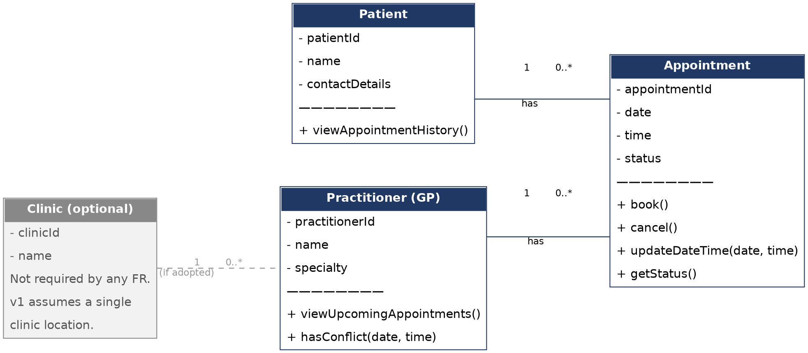

# Assignment 2 - Case Study
## Stage 3 Lab Activities — SmartCare Domain Modelling
### AI OFF

---

## Part A — Requirements Review

Nouns, verbs and business rules highlighted in SmartCare v0.2:

| Requirement | Nouns | Verbs | Business rule |
|---|---|---|---|
| FR-01 | staff, patient record, name, contact details | create | — |
| FR-02 | staff, practitioner record, name, specialty | create | — |
| FR-03 | staff, appointment, patient, practitioner, date, time | book | An appointment must have a patient, a practitioner, a date and a time (NFR-03). |
| FR-04 | appointment, practitioner, date, time | prevent, book | **A practitioner cannot have two appointments at the same date/time** — the core conflict rule. |
| FR-05 | staff, appointment | cancel | — |
| FR-06 | cancelled appointments, appointment history | retain | **Cancelled appointments are never deleted** — they stay in history. |
| FR-07 | staff, patient, ID, name | search | — |
| FR-08 | practitioner, upcoming appointments | view | — |
| FR-09 | staff, appointment, date, time | update | — |
| FR-10 | appointment, status | display | **Every appointment must have a status** from a defined set (booked/cancelled/completed). |
| FR-11 | staff, patient, appointment history | view | — |
| FR-12 | staff, report, appointments, day | produce | — |

The two starred business rules (FR-04's conflict check and FR-06's retention rule) are the ones with the clearest structural impact on the domain model — they directly shape Appointment's behaviour and state.

---

## Part B — Candidate Classes

| Candidate concept | Supporting requirement(s) | State | Behaviour |
|---|---|---|---|
| Patient | FR-01, FR-07, FR-11 | patientId, name, contactDetails | create record; search by ID/name; view own appointment history |
| Practitioner | FR-02, FR-04, FR-08 | practitionerId, name, specialty | create record; view own upcoming appointments; reject conflicting bookings |
| Appointment | FR-03, FR-04, FR-05, FR-06, FR-09, FR-10 | appointmentId, date, time, status, linked patient, linked practitioner | book; cancel (status changes, retained in history); update date/time; report status |

---

## Part C — CRC Cards

### Patient

| Responsibilities | Collaborators |
|---|---|
| Store own identifying and contact details (FR-01) | Appointment |
| Provide own appointment history, including cancelled appointments (FR-06, FR-11) | |

### Practitioner

| Responsibilities | Collaborators |
|---|---|
| Store own name and specialty (FR-02) | Appointment |
| Provide own list of upcoming appointments (FR-08) | |
| Check whether a proposed time conflicts with an existing appointment (FR-04) | |

### Appointment

| Responsibilities | Collaborators |
|---|---|
| Hold its own date, time, status and links to one patient and one practitioner (FR-03, FR-10) | Patient |
| Change its own status when cancelled, without being deleted (FR-05, FR-06) | Practitioner |
| Support being updated to a new date/time (FR-09) | |

---

## Part D — UML Model

Classes, attributes, operations, associations and multiplicities:

**Associations (defensible against the requirements):**

- `Patient` **1 — 0..\*** `Appointment` — a patient may have zero or many appointments over time; every appointment references exactly one patient (Stage 2 assumption; FR-03, FR-11).
- `Practitioner` **1 — 0..\*** `Appointment` — a practitioner may have zero or many appointments; every appointment references exactly one practitioner (Stage 2 assumption; FR-04, FR-08).
- `Clinic` **1 — 0..\*** `Practitioner`, drawn dashed/greyed — not part of the confirmed model; included only to show where it would attach if the single-location assumption is ever revisited.

Both confirmed associations are plain associations (not composition or inheritance) — see the Relationship Reasoning answers in the Stage 3 Tutorial for why.
