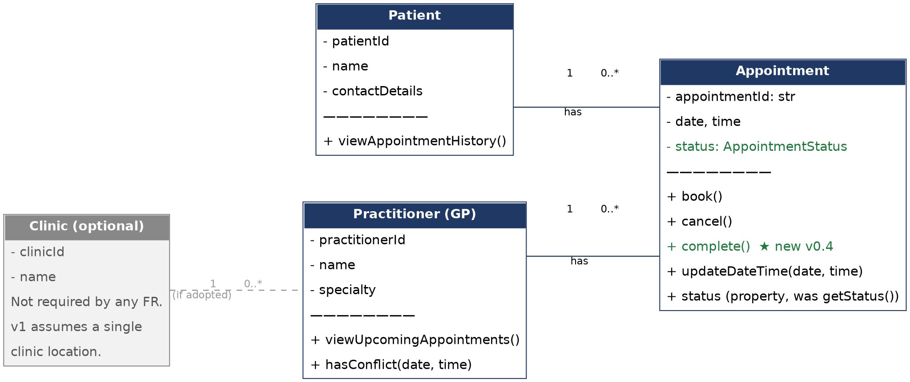

# SmartCare v0.4 — Domain Implementation Workbook

---

## 1. UML-to-Code Trace

| UML element | Python element | Implemented? | Notes |
|---|---|---|---|
| Patient (class) | `class Patient` | Yes | Direct translation of the v0.3 CRC card |
| Patient.patientId | `Patient._patient_id` / `.patient_id` property | Yes | Private field, read-only property |
| Patient.name | `Patient._name` / `.name` property | Yes | Validated non-empty at construction (NFR-03) |
| Patient.contactDetails | `Patient._contact_details` / `.contact_details` property | Yes | Validated non-empty at construction (NFR-03) |
| Patient.viewAppointmentHistory() | `Patient.view_appointment_history()` | Yes | Returns all appointments incl. cancelled (FR-06, FR-11) |
| Practitioner (class) | `class Practitioner` | Yes | Direct translation of the v0.3 CRC card |
| Practitioner.practitionerId/name/specialty | properties, as for Patient | Yes | Validated non-empty (NFR-03) |
| Practitioner.viewUpcomingAppointments() | `Practitioner.view_upcoming_appointments()` | Yes | Filters own appointments to SCHEDULED only |
| Practitioner.hasConflict() | `Practitioner.has_conflict(date, time)` | Yes | In-memory check, no database logic |
| Appointment (class) | `class Appointment` | Yes | Rebuilt in Part G after AI-generated version failed review |
| Appointment.appointmentId/date/time | properties | Yes | Private fields, read-only properties |
| Appointment.status | `Appointment._status: AppointmentStatus` / `.status` property | Yes | Formalised as an enum (SCHEDULED/CANCELLED/COMPLETED); read-only — no public setter |
| Appointment.book() | Constructor (`__init__`) | Yes | Booking *is* construction — an Appointment can't exist without being booked; validates required fields and checks `has_conflict()` (FR-04) before creating itself |
| Appointment.cancel() | `Appointment.cancel()` | Yes | Delegates to `_transition_to()`, which enforces the legal-transition rule |
| Appointment.updateDateTime() | `Appointment.update_date_time()` | Yes | Only legal while SCHEDULED; re-checks conflict for the new slot |
| Appointment.getStatus() | `.status` property | Yes | Renamed to a Pythonic property, not a method call — same behaviour |
| — (not in v0.3 UML) | `Appointment.complete()` | Yes | New — see Section 5, Updated UML |
| — (not in v0.3 UML) | `AppointmentStatus` (Enum), `IllegalStatusTransition` (Exception), `_ALLOWED_TRANSITIONS` (module-level table) | Yes | Supporting types needed to make status transitions enforceable in code |
| Clinic (optional class) | *not implemented* | No | Consistent with v0.3 — no FR requires it, so it stays undesigned in code, not just in the model |

---

## 2. Domain Invariants

| Class | Invariant / rule | How protected |
|---|---|---|
| Patient | `name` and `contact_details` must be non-empty (NFR-03) | Validated in `__init__`; raises `ValueError` if violated. Fields are private with no public setters, so the invariant can't be bypassed after construction. |
| Practitioner | `name` and `specialty` must be non-empty (NFR-03) | Same pattern — validated in `__init__`, private fields, read-only properties. |
| Appointment | An appointment must have a patient, a practitioner, a date and a time (NFR-03) | Validated in `__init__`; raises `ValueError` if any are missing. |
| Appointment | A practitioner cannot be double-booked (FR-04) | `Practitioner.has_conflict()` checked in `__init__` (booking) and again in `update_date_time()` (rescheduling); raises `ValueError` on conflict. |
| Appointment | Status can only move SCHEDULED → CANCELLED or SCHEDULED → COMPLETED; CANCELLED and COMPLETED are terminal (FR-05, FR-06, FR-10) | `_status` is private; every change goes through `_transition_to()`, which checks the `_ALLOWED_TRANSITIONS` table and raises `IllegalStatusTransition` on an illegal move. No public setter exists for `status` at all. |
| Appointment | Cancelled appointments are retained, never deleted (FR-06) | `cancel()` only ever changes `_status` — there is no delete/remove operation anywhere in the class or its collaborators. |

---

## 3. Composition / Inheritance Decisions

| Relationship | Decision | Rationale |
|---|---|---|
| Appointment – Patient | Association | Appointment *has a* Patient (FR-03, FR-11); nothing ties Appointment's lifecycle to Patient's, and FR-06 requires appointments to outlive any single interaction with a patient's record. |
| Appointment – Practitioner | Association | Same shape — Appointment *has a* Practitioner (FR-04, FR-08), not a type of one. |
| Doctor – Practitioner (hypothetical) | Inheritance | Doctor would be a specialised *kind of* Practitioner, sharing all its attributes/behaviour — a genuine is-a relationship, unlike the two above. |
| Clinic – Appointment (hypothetical) | Association (if ever adopted) | Composition would tie an appointment's existence to the clinic record, conflicting with FR-06's retention requirement. No FR currently requires Clinic at all, so this stays hypothetical. |
| Appointment (AI-generated) – PatientRecord | **Rejected** | The AI's own suggestion; not a relationship in the confirmed model. Appointment doesn't inherit from anything — see Section 4. |

---

## 4. AI Pair-Programming Record

| AI contribution | Conforms? | Decision | Reason | Verification |
|---|---|---|---|---|
| `AppointmentStatus` enum (SCHEDULED/CANCELLED/COMPLETED) | Yes | **Accept** | Matches FR-10's three status values; a genuine type-safety improvement over a raw string. | Compared directly against FR-10's wording — no mismatch. |
| Inheritance: `Appointment(PatientRecord)` | No | **Reject** | Appointment doesn't inherit from anything in the confirmed model — it has a Patient, it isn't one (Section 3). | Reviewed against v0.3 UML and Tutorial Activity 2, which reached the identical answer for the real Patient/Appointment relationship. |
| SQL call inside `cancel()` | No | **Reject** | No FR asks for a database layer; NFR-02 requires business logic separate from persistence/display code. | Manual test (Lab Part F) showed the domain object can't be exercised or tested without a live database connection — a direct NFR-02 violation. |
| `NotificationManager` dependency | No | **Reject** | No FR supports notifications/reminders. | Already rejected once before with the same reasoning, in Stage 3's AI Design Review Record — repeat offence, same evidence. |
| Public `status` attribute | No | **Reject** | Allows any code to put an Appointment into an invalid state, bypassing `cancel()`/`complete()` entirely. | Manual test (Lab Part F) reproduced the bug directly: `appt.status = AppointmentStatus.SCHEDULED` succeeded with no error. |
| No validation / no transition guard | No | **Reject** | Violates NFR-03 (required fields) and lets illegal transitions (e.g. cancelling twice) succeed silently. | Manual test (Lab Part F) reproduced both bugs directly; Lab Part G's re-run confirms both now raise the correct exception. |

---

## 5. Updated UML

Implementation did reveal one justified design change — everything else below is a notation/typing refinement, not a structural change.

**Change 1 — added `Appointment.complete()`.** The v0.3 UML gave Appointment three operations (`book`, `cancel`, `updateDateTime`) plus `getStatus`, but `status` had always included a third value, "completed" (FR-10), with no operation that could legally produce it. This only surfaced once the transition table had to be written out explicitly in code (Lab Part G) — the model looked complete on paper because "completed" was just one value in a list, but nothing actually *reached* that value. `complete()` mirrors `cancel()`: same guard, same pattern, and adds no new class or dependency, so it's a small, evidence-driven addition rather than new scope.

**Change 2 (notation only) — `status` typed as `AppointmentStatus` and exposed as a property, not `getStatus()`.** Same meaning as v0.3, just made type-safe and written in the idiomatic Python style rather than a Java-style getter.

Updated diagram (Appointment box only changed; Patient, Practitioner and the optional Clinic card are unchanged from v0.3):

